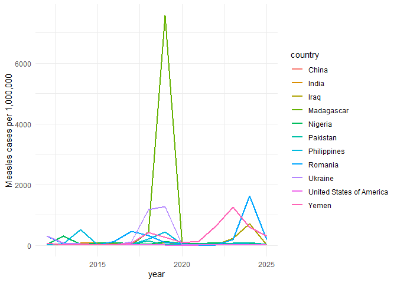
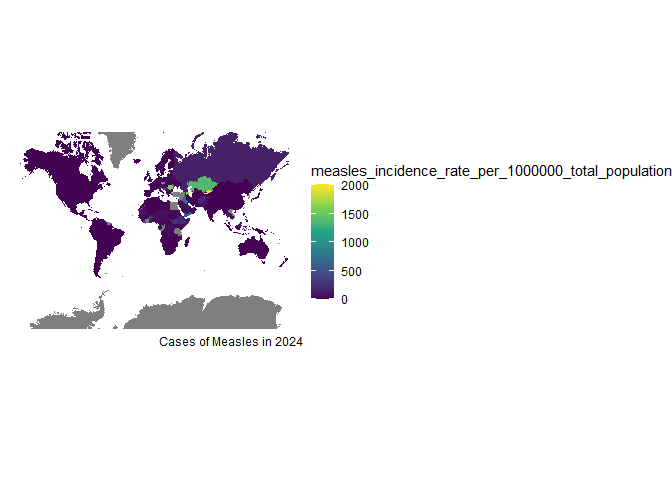
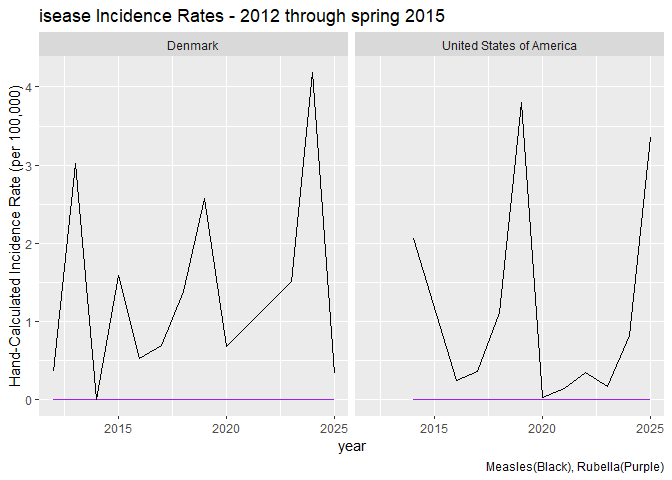

``` r
library(tidyverse)
library(dplyr)
library(ggplot2)
library(plotly)
library(here)
cases_year <- readr::read_csv('https://raw.githubusercontent.com/rfordatascience/tidytuesday/main/data/2025/2025-06-24/cases_year.csv') |>
  mutate(hand_incidenceR_measles = (measles_total / total_population)*1000000) |>
  mutate(hand_incidenceR_rubella = (rubella_total / total_population)*1000000)
```

# Purpose:

Data Visualizations Final Project, Data Visualizations II

### Data

The data used for this project was pulled from the TidyTuesday Github
repository, posted June 24th, 2025, and titled “Measles cases across the
world”.  
It contains Measles and Rubella disease counts for various countries,
with data ranging from 2012 through June of 2025.  
Case counts are further divided by level of certainty of disease
identification, and an incidence rate for each year is also provided.  
  

### Questions

- What are the top 10 countries with the highest record cases of
  Measles? How does the USA compare to these countries?  
- Did the Covid-19 Pandemic have an impact on Measles cases?  
- Is there a visible rise in Global Measles cases since 2012?  
- In terms of Measles cases, how is the US doing compared to other
  countries?  

### Timeline History of Countries With the Largest Measles Outbreaks

``` r
#Top 10 countries that have had the record highest total measles cases during the span of 2012 - 2025:
top10_yearspan_measles <-
  cases_year |>
  group_by(country) |>
  arrange(desc(measles_total)) |>
  slice(1) |>
  ungroup(country) |>
  arrange(desc(measles_total)) |>
  slice(1:10) |>  # Now take the names of just those top countries:
  distinct(country) |> 
  pull(country)

# Filter the dataset to only include the top historical measles countries, and the USA for comparison
top10nUSA_measles_tot <-
  cases_year |>
  filter(country %in% top10_yearspan_measles | country == "United States of America") 
  
# Incidence Rate Plot:
top10measlesI_plot <-
ggplot(data = top10nUSA_measles_tot, aes(x = year, y = hand_incidenceR_measles)) +
  #facet_wrap(~region) +
  geom_line(aes(color = country), linewidth = 1) +
  theme_minimal() +
  labs(y = "Measles cases per 1,000,000")

#ggplotly(top10measlesI_plot, tooltip = c("color", "x", "y"))
top10measlesI_plot
```

<!-- --> Incidence
rate was used as the disease measure (opposed to plain case counts) as
it provides a value that’s adjusted for each country’s respective
population size.  
Referencing this line plot, it seems like countries “take turns” having
outbreaks, opposed to a high-count, sustained level of measles cases.  
From a historical lens, there’s also a notable collective dip in Measles
cases right as the Covid-19 Pandemic hit. This drop in cases could be
due to social distancing, increased sanitary practices, or under
reporting cases. Madagascar’s surging peak in 2019 is currently the
largest Measles outbreak on record, and was primarily caused by a lack
of immunization/herd immunity. The US in comparison to the top 10
countries has a minute amount of Measles cases, so in comparison to the
globe, the US is managing measles more effectively.

### Rshiny App: Global heat map of disease cases

``` r
world_map <- map_data("world")
cases_year_nameAdjust <- #filter to start, fix country names to show up on map
  cases_year |>
  mutate(country = if_else(country == "United States of America", 
                           true = "USA", 
                           false = country)) |>
  mutate(country = if_else(country == "Russian Federation", 
                           true = "Russia", 
                           false = country)) |>
  mutate(country = if_else(country == "Venezuela (Bolivarian Republic of)", 
                           true = "Venezuela", 
                           false = country)) |>
  mutate(country = if_else(country == "Iran (Islamic Republic of)", 
                           true = "Iran", 
                           false = country)) |>
  mutate(country = if_else(country == "Democratic People's Republic of Korea", 
                           true = "North Korea", 
                           false = country)) |>
  mutate(country = if_else(country == "Bolivia (Plurinational State of)", 
                           true = "Bolivia", 
                           false = country)) |>
  mutate(country = if_else(country == "United Kingdom of Great Britain and Northern Ireland", 
                           true = "UK", 
                           false = country)) |>
  mutate(country = if_else(country == "Netherlands (Kingdom of the)", 
                           true = "Netherlands", 
                           false = country)) 

cases_1year <- 
  cases_year_nameAdjust |>
  filter(year == 2024)

#join the datasets:
full_worldMeasles <- left_join(world_map, cases_1year, 
                           join_by(region == country))
#plot the map:
ggplot(data = full_worldMeasles, aes(x = long, y = lat, 
                                 group = group)) +
  geom_polygon(aes(fill=measles_incidence_rate_per_1000000_total_population)) +
  scale_fill_viridis_c() +
  coord_map(projection = "mercator") +
  xlim(c(-180,180)) +
  labs(caption = "Cases of Measles in 2024") +
  theme_void()
```

<!-- --> This is a
sample map of what can be created within this project’s Rshiny App. This
has the parameters of year 2024 and the total number of measles cases
per country shown.  
Panning through the app, we can visually assume that Measles isn’t
increasing in global prevalence. While each country has its outbreaks,
some occurring more frequently than others, this data set doesn’t
display or suggest a Measles Pandemic. Within this Shiny app, you can
select for year, disease, and the fill variable for the map. The options
range from incidence rate to total counts, to varying case confirmation
types.  
It was created with the purpose of users exploring their own curiosities
about the data.  

## US vs Denmark

``` r
subdata_USAdk<- 
  cases_year |>
  filter(country == "United States of America" | country == "Denmark")  #| country == "Philippines"

USAdk_comboplot <-
  ggplot(data = subdata_USAdk, aes(x= year, label1 = total_population, label2 = rubella_total, label3 = measles_total)) +
  geom_line(aes(y = hand_incidenceR_rubella), color = "purple", show.legend = TRUE)+
  geom_line(aes(y = hand_incidenceR_measles), color = "black", , show.legend = TRUE) +
  facet_wrap(~country) +
  labs(y = "Hand-Calculated Incidence Rate (per 100,000)", 
       title = "isease Incidence Rates - 2012 through spring 2015",
       caption = "Measles(Black), Rubella(Purple)")

# ggplotly(USAdk_comboplot, tooltip = c("x", "y", "label1", "label2", "label3")) |>
#   layout(
#     title = list(
#       text = "Disease Incidence Rates - 2012 through spring 2015", 
#       x = 0.5,  # Center title
#       xanchor = "center",
#       font = list(size = 16)),
#     annotations = list(
#       # Caption text
#       list(
#         text = "Measles(Black),
#         Rubella(Purple)",
#         xref = "paper",  # relative to the entire plot area
#         yref = "paper",
#         x = 0,           # left side
#         y = -0.15,       # below the x-axis
#         showarrow = FALSE,
#         font = list(size = 12, color = "gray1"),
#         align = "left")
#       ))
USAdk_comboplot
```

<!-- --> In comparison
to the globe, the US is managing measles well. But, the large outbreak
numbers is visually drowning out the US’s measles presence.  
This visualization compares the US to Denmark, due to a personal
fondness of Denmark and a similarity in total case counts, so that we
can view a disease pattern.  
Both Denmark and the USA have the Covid-19 pandemic drop in 2020, and
have Rubella rates consistently at zero. Their patterns of measles
incident rates almost mirror each other after 2016 as well, but it’s
important to consider how there is some missing data for the US. This
data set provides no measles data for the US until 2014, skipping 2015,
before providing yearly rates up through spring of 2025. So while at
first glance its a near exact match in pattern, the Danish Measles case
data starts at 2012 while the US’s starts at 2014-ish-2016.
